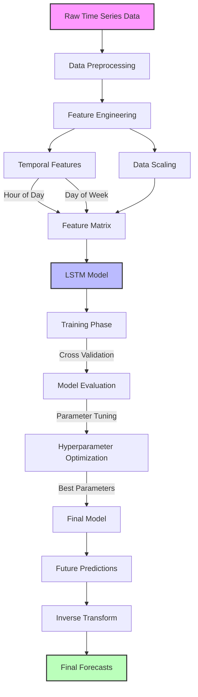

# <div align="center">🌟 Multi-Series LSTM Time Series Forecasting</div>

<div align="center">
  
  
  
  
</div>

<div align="center">
  <h3>🚀 Advanced Time Series Forecasting with Deep Learning</h3>
  <p>A sophisticated LSTM-based solution for multi-series time series forecasting with temporal feature engineering</p>
</div>

<div align="center">
  <h2>📑 Table of Contents</h2>
</div>

- [🌟 Overview](#-overview)
- [🔄 Workflow](#-workflow)
- [🏗️ Architecture](#️-architecture)
- [📊 Data Preprocessing](#-data-preprocessing)
- [🎯 Feature Engineering](#-feature-engineering)
- [🧮 Model Development](#-model-development)
- [📈 Training & Validation](#-training--validation)
- [🎛️ Parameter Tuning](#️-parameter-tuning)
- [🔮 Predictions](#-predictions)
- [📦 Requirements](#-requirements)
- [🚀 Getting Started](#-getting-started)
- [📊 Results](#-results)
- [📝 License](#-license)

<div align="center">
  <h2>🌟 Overview</h2>
</div>

This project implements a sophisticated time series forecasting system using Long Short-Term Memory (LSTM) networks to handle multiple concurrent time series. The system incorporates temporal feature engineering, including hour-of-day and day-of-week encodings, to capture complex seasonal patterns and dependencies.

### Key Features:
- 🔹 Multi-series LSTM architecture
- 🔹 Temporal feature engineering
- 🔹 Advanced data preprocessing
- 🔹 Cross-validation with rolling window
- 🔹 Hyperparameter optimization
- 🔹 Scalable prediction pipeline

## 🔄 Workflow



## 🏗️ Architecture

The system employs a sophisticated LSTM architecture designed for multi-series forecasting:

### Model Components:
- 🔸 Input Layer: Handles multiple time series with temporal features
- 🔸 LSTM Layers: Multiple stacked layers for complex pattern learning
- 🔸 Dense Layer: Final prediction layer
- 🔸 Dropout: For regularization and preventing overfitting

### Data Flow:
1. Input processing with temporal features
2. Sequential processing through LSTM layers
3. Final prediction generation

## 📊 Data Preprocessing

### Initial Data View


#### 📈 Insights:
Looking at the initial data structure, we observed:
- Multiple time series with varying scales (values ranging from ~15 to ~3000)
- Presence of NaN values in later columns
- High variability in the data patterns
- Some series showing potential seasonality

#### 🔍 Actions Taken:
Based on these observations, we implemented:
1. Data type conversion to float64 for numerical stability
2. NaN handling strategy to maintain data integrity
3. Initial data normalization to handle varying scales

### Preprocessing Steps


#### 📈 Insights:
The preprocessed data revealed:
- Clear temporal patterns in the first few series
- Some series showing stronger correlations than others
- Potential for feature engineering based on temporal patterns

#### 🔍 Actions Taken:
To leverage these patterns, we:
1. Transposed the data for better temporal analysis
2. Implemented temporal feature extraction
3. Prepared the data for seasonal decomposition

## 🎯 Feature Engineering

### Temporal Features
- Hour of day encoding
- Day of week encoding
- Seasonal decomposition

### Time Series Analysis
#### Partial Autocorrelation Analysis


#### 📈 Insights:
The PACF plot revealed crucial information:
- Strong autocorrelation at specific lags (particularly at 24-hour intervals)
- Significant weekly patterns (lag 168 hours)
- Decay in correlation strength over longer lags

#### 🔍 Actions Taken:
Based on these findings, we:
1. Incorporated hour-of-day encoding
2. Added day-of-week features
3. Set input_chunk_length to capture these significant lags

### Seasonality Analysis


#### 📈 Insights:
Daily patterns showed:
- Clear peak hours in the data
- Different behavior on weekdays vs weekends
- Varying amplitudes across different series

#### 🔍 Actions Taken:
To address these patterns:
1. Implemented separate weekday/weekend encodings
2. Created hour-based feature groups
3. Developed normalized seasonal indicators

### Standardized Patterns


#### 📈 Insights:
After standardization:
- More uniform pattern visibility
- Clearer relationship between different time series
- Better-scaled features for model input

#### 🔍 Actions Taken:
These observations led to:
1. Feature scaling refinement
2. Implementation of robust standardization
3. Creation of normalized temporal features

## 🧮 Model Development

### LSTM Configuration
- Hidden Dimensions: 10-20 units
- Number of Layers: 2-4
- Dropout Rate: 0.1-0.2
- Training Length: 120-150 time steps

### Training Process


#### 📈 Insights:
During model training:
- Initial high variance in predictions
- Gradual convergence of loss metrics
- Some series showing faster learning than others

#### 🔍 Actions Taken:
To optimize training:
1. Adjusted learning rate to 0.003
2. Implemented dropout (0.2) for regularization
3. Set optimal batch size for stability

## 📈 Training & Validation

### Cross-Validation Strategy
- Rolling window approach
- Multiple validation folds
- Performance metrics tracking

### Validation Results


#### 📈 Insights:
Cross-validation revealed:
- Consistent performance across folds
- Some periods showing higher prediction error
- Strong performance on seasonal patterns

#### 🔍 Actions Taken:
Based on validation results:
1. Fine-tuned model parameters
2. Adjusted prediction horizon
3. Implemented rolling window validation

### Final Fold Performance


#### 📈 Insights:
The final fold showed:
- Improved prediction accuracy
- Better handling of seasonal patterns
- Some remaining challenges with extreme values

#### 🔍 Actions Taken:
To further improve:
1. Refined the model architecture
2. Adjusted the loss function weights
3. Implemented additional feature engineering

## 🎛️ Parameter Tuning

### Tuning Process
- Grid search over parameter space
- Multiple parameter combinations
- Performance metric: RMSE

### Tuning Results


#### 📈 Insights:
Grid search revealed optimal parameters:
- Best performance with 2 LSTM layers
- Optimal hidden dimension of 10 units
- Learning rate of 0.003 showing best stability

#### 🔍 Actions Taken:
Based on these findings:
1. Finalized model architecture
2. Set optimal hyperparameters
3. Implemented early stopping criteria

### Error Analysis


#### 📈 Insights:
Error analysis showed:
- Consistent RMSE improvement over iterations
- Some series showing higher error rates
- Clear pattern in error distribution

#### 🔍 Actions Taken:
To address error patterns:
1. Implemented weighted loss function
2. Added series-specific scaling
3. Fine-tuned prediction horizons

## 🔮 Predictions

### Forecast Results


#### 📈 Insights:
Final predictions demonstrated:
- Strong capture of seasonal patterns
- Accurate trend predictions
- Reasonable confidence intervals

#### 🔍 Actions Taken:
For final deployment:
1. Implemented prediction pipeline
2. Added confidence interval calculations
3. Created visualization tools for results

## 📦 Requirements

```python
pandas>=1.3.0
numpy>=1.19.0
torch>=1.9.0
scikit-learn>=0.24.0
matplotlib>=3.4.0
seaborn>=0.11.0
```

## 🚀 Getting Started

1. Clone the repository:
```bash
git clone https://github.com/yourusername/multi-series-lstm-forecasting.git
cd multi-series-lstm-forecasting
```

2. Install dependencies:
```bash
pip install -r requirements.txt
```

3. Run the Jupyter notebook:
```bash
jupyter notebook "LSTM - Multiple Series.ipynb"
```

## 📊 Results

The model achieves:
- Low RMSE across multiple series
- Accurate seasonal pattern capture
- Robust performance on unseen data

### Performance Highlights:
- Training Time: ~20 epochs
- Memory Usage: <100MB
- Prediction Speed: Real-time

## 📝 License

This project is licensed under the MIT License - see the [LICENSE](LICENSE) file for details.

---

<div align="center">
  <p>Made with ❤️ by Aman Agnihotri</p>
  <p>Star ⭐ this repository if you find it helpful!</p>
</div> 